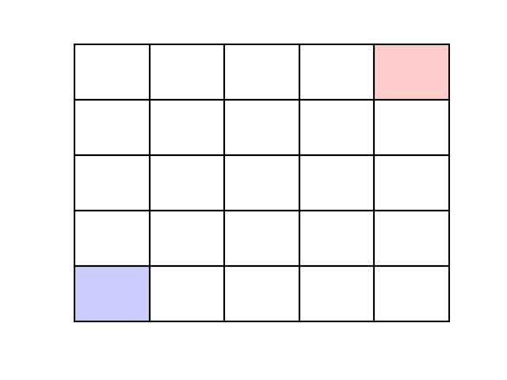
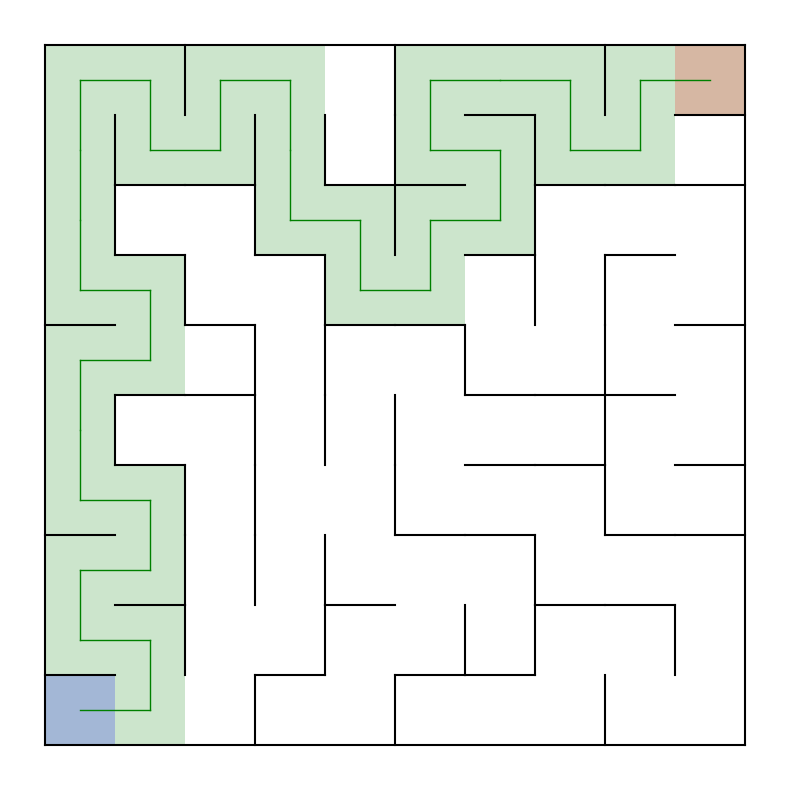
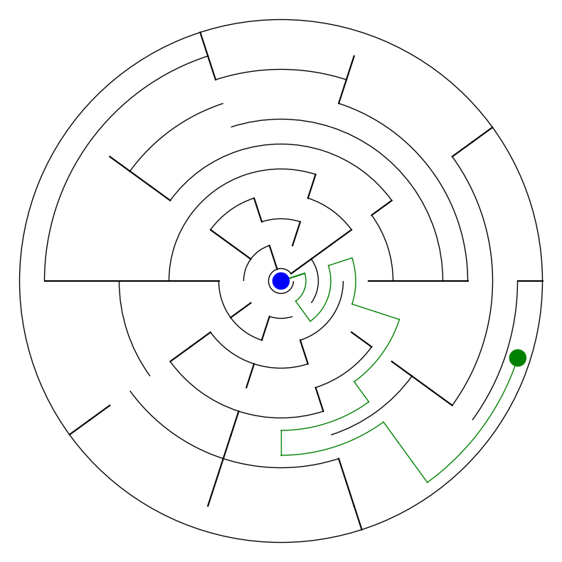
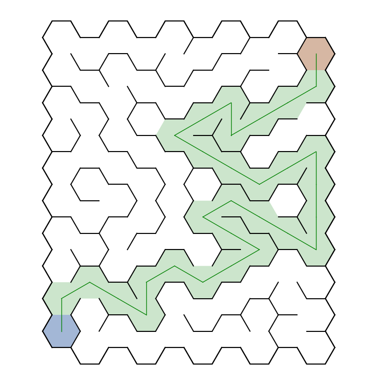
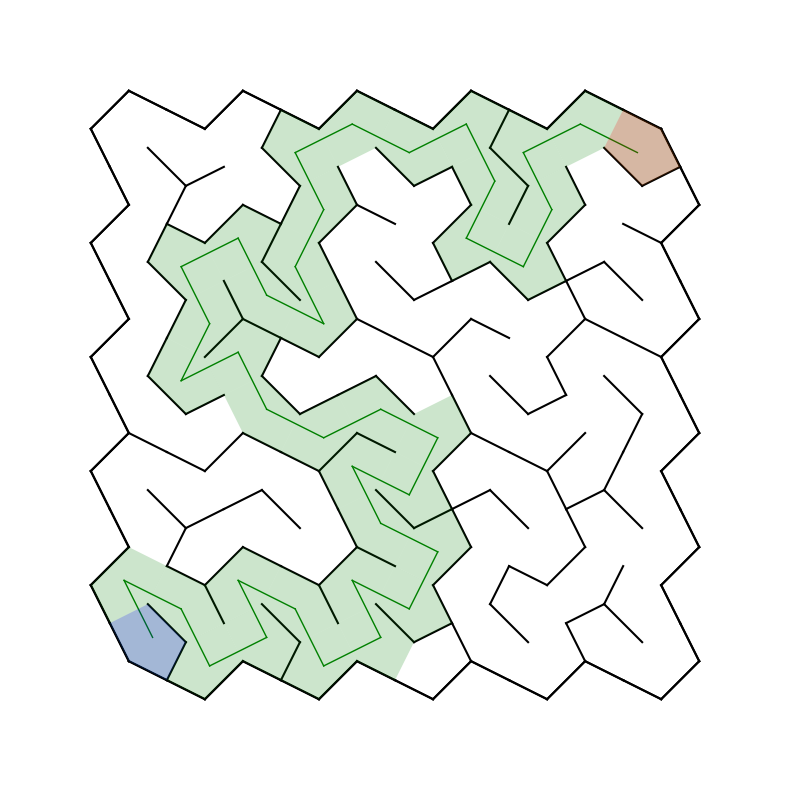
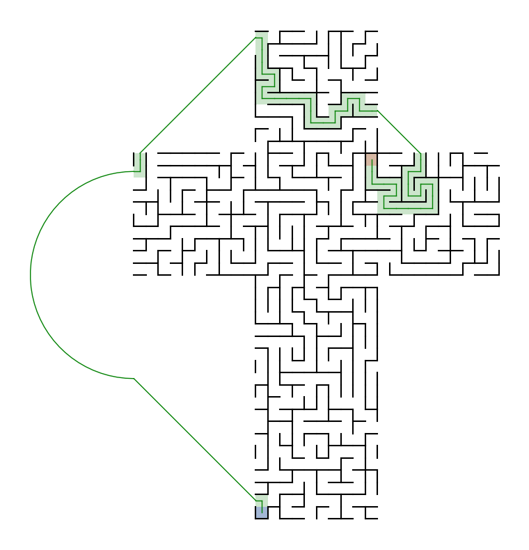
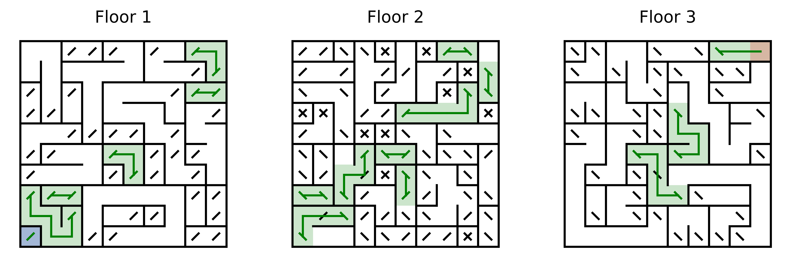

# mazegen

A simple python library to generate printable labyrinth.

## Algorithm Visualization


## Rectangular Maze


## Polar Maze


## Hexagonal Maze


## Voronoi Maze


## Cube Maze


## 3D Maze


## Usage
```
usage: mazegen.py [-h] [-T {rect,polar,voronoi,hex,3d,cube}] [-W W] [-H H] [-D]
                  [-S] [-M MINLEN] [-O OUTDIR] [-s] [-sh {,L,O,H}]
                  [-pb BORDER_WIDTH] [-si] [-se SEED] [-dr] [-m MODE]

optional arguments:
  -h, --help            show this help message and exit
  -T {rect,polar,voronoi,hex,3d,cube}, --type {rect,polar,voronoi,hex,3d,cube}
                        Maze type selector
  -W W, --w W           Maze width in cells
  -H H, --h H           Maze height in cells
  -D, --debug           Enable debug mode
  -S, --show            Enable matplotlib graphical widget
  -M MINLEN, --minlen MINLEN
                        Set maze route minimum length
  -O OUTDIR, --outdir OUTDIR
                        Output directory
  -s, --solve           Enable solution generation, in combo with --show
  -sh {,L,O,H}, --shapetype {,L,O,H}
                        Select rectangular type obstacle shapes
  -pb BORDER_WIDTH, --border-width BORDER_WIDTH
                        Set points random border width
  -si, --show-id        Enable node id label, in combo with --debug
  -se SEED, --seed SEED
                        Set numpy random seed
  -dr, --dry-run        Enable dry run: generate maze and disable png creation
  -m MODE, --mode MODE  Mode selector: debug|test|path/to/json
```